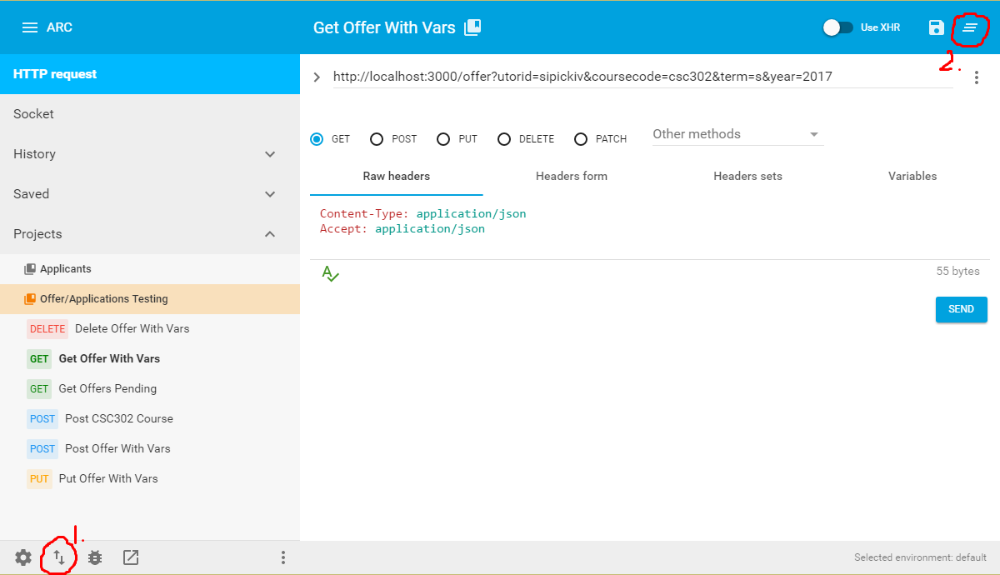

# Phase 2 Technical Progress Report

## Table of Contents

- [Current Build](#current-build)
- [Product Design](#product-design)
- [Technical Highlights](#technical-highlights)
- [Teamwork](#teamwork)
- [Triage](#triage)

# Current Build

- What did you actually build during this phase?
    - How is this different from what you originally proposed? Why?

### Front End

For phase two, we scaffolded a general layout with placeholder data that will be replaced with the data retrieved through a server API. Also, we have begun to implement a data flow structure, namely the flux data architecture presented by Facebook through the form of Redux, one of many unidirectional data flow libraries.

We narrowed the scope of the components we plan to build and focus on, trimming out unnecessary features from our original proposition such as login, signup, term import and creation (unless time permits).

### Back End

A database schema was created and applied to a live Postgres database. Backend routes were created and routed to controllers for processing requests from the frontend. The database tables for applicants, courses, and applications are fully functional with create, update, retrieve, delete, and other features necessary as described in the previous design document, as well as documented using Swagger. Work has also begun for the TA recommendation system, which will aid the TA coordinator in making TA assignmenents. 

# Product Design

The overall design of the system has been changed slightly since inception, the main difference being that the recommendation system has been rolled into the TA Coordinator service instead of as a standalone service.  This decision was made due to the fact that, since the app is rather specialized and not meant for a large audience, the system usage and the databases will not be large enough to present a problem with run-time.  We have also scrapped the authentication aspect as it was not one of our focuses (as advised by Professor Zaleski).

### TA Coordinator Client Application

The TA Coordinator Client Application will be made with React following MVC design and also Redux to ensure unidirectional data flow among client application components. The application will send asynchronous requests to the TA Coordinator Service and display the results through a UI.

Primary Responsibilities:
- Handle all user interactions.
- Make usage of the system as easy and intuitive as possible.
- Present all information in an efficient manner.
- Allow HR specialist to see progress at a glance.
- Allow HR specialist to sort filter and search through candidates for each position.
- Data from backend will populate pages via AJAX calls.
- Allow downloading of files in human readable format.

### TA Coordinator Service

The TA Coordinator Service will be built in NodeJS under the Express framework. Through its REST API, it will receive requests from an outside Applicant API. The service will cover all the use cases regarding courses and terms and communicate with a PostgreSQL database. The TA Coordinator may build a term through the service or call an API that returns a term which the service will use to generate one.  Applicants can be recommended for specific courses as required by the TA Coordinator Client Application.

# Technical Highlights

- Technical highlights: interesting bugs, challenges, lessons learned, observations, etc.

#### Bugs

  
> Error: Can't set headers after they are sent to the client

One bug that a few of our members came across was the inability to send several json objects to the client.

How we ran into it:
```javascript
    if (err) {
      sendError(res, 400, err);
    }
    sendError(res, 404, "Course not found");
```
And similar code.

Explanation: In the worst case, the sendError callback gets called and the response is set in the callback (```res.status(errorCode).send(json);```). However after the function is completed, it is not returned and it continues to the method outside of the if statement which proceeds to send the response again. The res objects in Express don't allow headers to be edited when you're in the Body or Finished state.

Fix: Use if/elseif/else statements to avoid confusion. Alternatively use next() or return to exit the function.

  
> Warning: React array components should contain a key for indexing

React's implementation of efficient DOM manipulation suggests to store keys for iterated components.

Fix: Pass an index parameter from es6 map call as a temporary solution for unique indexing until the unique id can be stored when retrieved from the server API.

> Advanced REST Client Tester Bugs

The back-end team used [Advanced REST Client](https://chrome.google.com/webstore/detail/advanced-rest-client/hgmloofddffdnphfgcellkdfbfbjeloo) for testing routes. Some of the common problems using this application were:

1. Specifying the wrong content-type when sending requests. 
Fix: When using forms (for POST and PUT), use ```application/x-www-form-urlencoded```.
2. Confusing req.body with req.query. 
Fix: Use req.query for URL queries of the form ```/offer?course=csc302``` and use req.body for form requests.
3. Pressing the wrong buttons.
They're a bit unintuitive. Commonly mistaken buttons were the (1) "import/export " button (forever elusive) and (2) "clear all" button (yikes!).



> Database

One of the issues that took nearly 2 hours to debug was an Advanced Rest Client bug which returned 
```
"error_code": 404,
"name": "error",
"file": "numutils.c",
"line": "73"
```
Fix: At first, we thought the JSON was being parsed incorrectly but that was not the case. Then we thought that it was a PostgreSql limitation that only a certain length could be passed through without error (since integers/strings of 9 digits didn't return an error but 10+ did). After searching the [PostgreSQL documentation](https://www.postgresql.org/docs/9.1/static/datatype-numeric.html), we had figured out that the data type **integer** was too small to contain the telephone numbers (at most 214748364) and returned an out of bounds error. Furthermore, this explains why the best practice for storing telephone numbers has been strings as they could also be formatted.

#### Challenges

> Client set-up

A challenge was to scaffold and ensure everything on the front-end was working to get started. Setting up the initial redux actions and stores to fit our directory structure was also a challenge that required a good amount of time to implement.

> Setting up Automated Tests

On the front-end side, most of the auto-testing frameworks and code linter frameworks were set up with the click of a button (yeoman generator) but it wasn't as simple for the back-end. When deciding which frameworks to use for back-end, we had to take into account what kind of tests we would be writing (unit tests, end to end tests). We decided that we should use Karma for automating tests, Mocha for the actual test writing, and Chai for assertions in the tests. Furthermore ESLint was chosen as a code linter with custom rules that are far less stricter than popular libraries.


# Teamwork
- Reflect on your teamwork and process. What worked well, what  needs improvement.
    - Ideally you will have specific artifacts from your development process to show (for instance, a burndown chart)

We divided our team into front end and back end teams. Currently, the results have been greatly effective in delegating specific tasks and narrowing scope.

Our "mini-sprints" of small but specific tasks are effective in pushing out modular components and scaffolding design. Progress is visible and accessible to both front end and back end teams.

### Artifacts

Our team utilizes [Github issues](https://github.com/csc302-2017-spring/proj-ItWorkedYesterday/issues) as well as a [project sprint chart](https://github.com/csc302-2017-spring/proj-ItWorkedYesterday/projects/1)

# Triage
- What will you build for phase 3, the final demo?

We will implement functionality and integration and replace mocked data calls with actual server API calls. We plan to demo the workflow of a TA coordinator in through intuitive and clean design. The applicant recommendation system for courses is also a focus we focus on building for the final demo.
